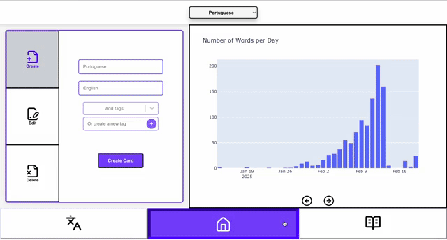

# 🌍 AI Language Trainer: A Personalized Language Learning System

  

## Overview
The AI Language Trainer is an intelligent language-learning tool that reinforces vocabulary through flashcards and generates custom stories incorporating learned words. Using machine learning, it adapts to the user’s progress, making language acquisition more engaging and effective.

As an avid traveler with a passion for language learning, I built this system to streamline the language learning process. This project is designed not just from a technical perspective but from the viewpoint of someone who has experienced the challenges of language learning firsthand. By integrating adaptive learning strategies and AI-driven contextual practice, this system offers a highly effective way to build and reinforce language skills.

### Features
  - Smart Flashcards – Spaced repetition algorithm to optimize word retention.
  - AI-Generated Stories – Dynamically created narratives using learned vocabulary.
  - Multi-Language Support – Train with different languages and difficulty levels.
  - Progress Tracking – Monitors learning patterns and adjusts difficulty accordingly.
  - User-Friendly Interface – Simple, intuitive design for seamless learning.

### Tech Stack
  - Frontend: React.js, Plotly
  - Backend: Flask
  - Machine Learning: SciKit Learn, Logistic Regression, Natural Language Processing (NLP)
  - Database: SQLite
  - Model Deployment: Pickle (model.pkl, scaler.pkl)

### How It Works
  - Choose a Language
  - Train with Flashcards
  - Generate personalized AI stories with your vocabulary words.
  - Track Progress – Improve over time with adaptive difficulty.

### Future Enhancements
  - Speech Recognition – Pronunciation feedback with voice input.
  - Grammar Corrections – AI-driven grammar feedback for user-generated sentences.
  - Mobile App – Expand to iOS and Android for learning on the go.

### Impact
This project bridges AI and language learning, making it interactive and personalized. It’s an effective language companion designed by someone who has experienced the learning process firsthand.

🚀 Want to Contribute?
Fork the repo, enhance the story generation model, or suggest new features!
